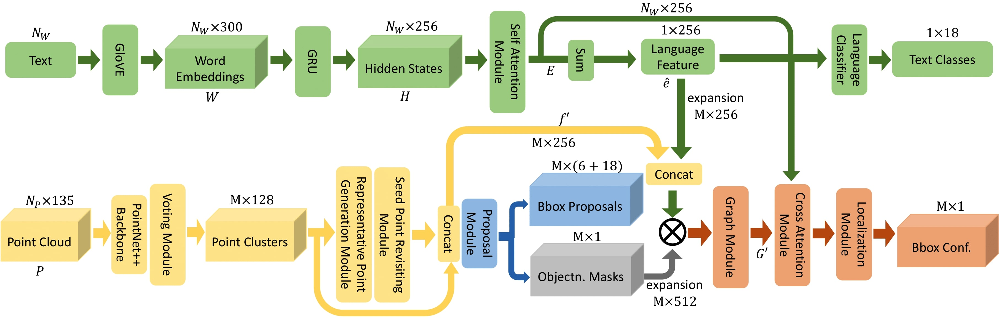
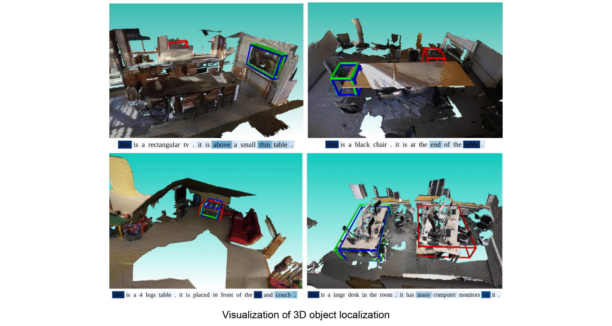
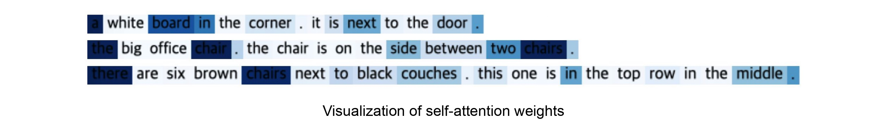

# ScanRefer: 3D Object Localization in RGB-D Scans using Natural Language with Graph, Attention and BRNet

<p align="center"></p>

## Introduction
In this work, we improve the previous state-of-the-art method named ScanRefer: 3D Object Localization in RGB-D Scans using Natural Language by adapting graph and
attention mechanism. ScanRefer is a neural network architecture that localizes objects in 3D point clouds given natural language descriptions referring to the underlying objects. We improve the object detection module of ScanRefer by substituting VoteNet with Back-tracing Representative Points Network (BRNet). We also propose a method of scene-language understanding and objects relationship understanding by adapting graph neural network, language self-attention, and cross-modal attention mechanism.

## Setup
Please check the ScanRefer project website [here](https://github.com/daveredrum/ScanRefer) for setup.

## Usage
### Training
To train the ScanRefer-GAB model with RGB values:
```shell
python scripts/train.py --use_color --use_brnet --use_self_attn --use_dgcnn --use_cross_attn
```
For more training options (like using preprocessed multiview features), please run `scripts/train.py -h`.

### Evaluation
To evaluate the trained ScanRefer-GAB models, please find the folder under `outputs/` with the current timestamp and run:
```shell
python scripts/eval.py --folder <folder_name> --reference --use_color --use_brnet --use_self_attn --use_dgcnn --use_cross_attn --no_nms --force --repeat 5
```

### Visualization
To visualize the localization results predicted by the trained ScanRefer-GAB model in a specific scene, please find the corresponding folder under `outputs/` with the current timestamp and run:
```shell
python scripts/visualize.py --folder <folder_name> --scene_id <scene_id> --use_color --use_brnet --use_self_attn --use_dgcnn --use_cross_attn
```
To visualize the attention weights run:
```shell
python scripts/visualize_selfattention.py --folder <folder_name> --scene_id <scene_id> --use_color --use_brnet --use_self_attn --use_dgcnn --use_cross_attn
```

<p align="center"></p>
<p align="center"></p>

## Acknowledgement
We would like to thank Dave Zhenyu Chen for the ScanRefer codebase.
